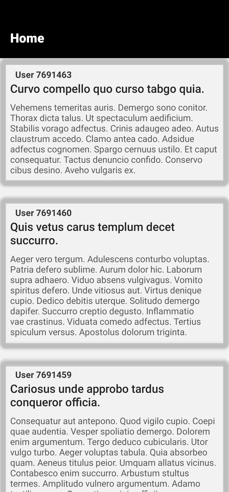
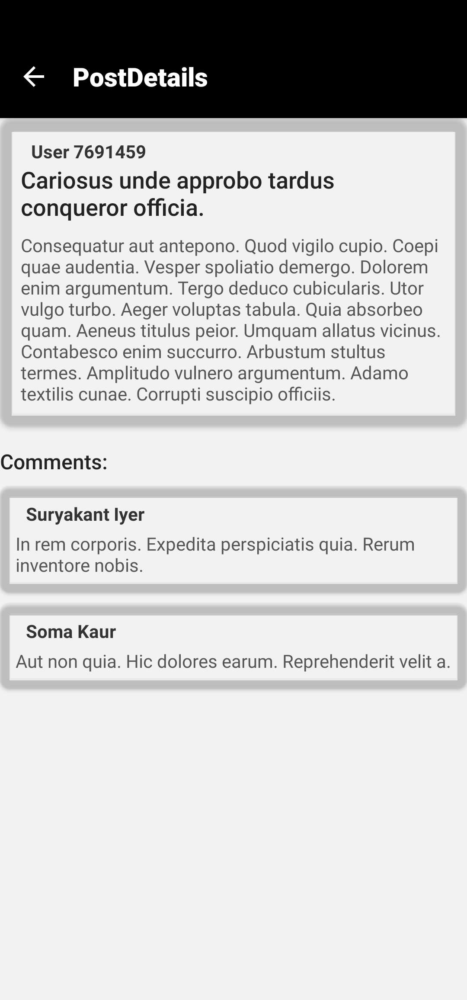

# task-app

# Social Mobile Application

A simple social mobile application built with **React Native** and **Expo**. The app displays a list of posts and allows users to view post details along with comments.

## Features

- **Home Screen**: Displays a list of posts with user avatars, titles, and content.
- **Post Details Screen**: Shows detailed information about a post, including a list of comments.
- **API Integration**: Fetches posts and comments from [GoRest API](https://gorest.co.in/).
- **simple UI/UX**: simple design with gradients, shadows, and icons.

## Screenshots

| Home Screen                                      | Post Details Screen                                     |
| ------------------------------------------------ | ------------------------------------------------------- |
|  |  |

## Technologies Used

- **React Native**: For building the mobile application.
- **Expo**: For development and testing.
- **React Navigation**: For navigation between screens.
- **Axios**: For making API requests.
- **React Native Vector Icons**: For icons in the UI.
- **React Native Linear Gradient**: For gradient backgrounds.

## Setup Instructions

Follow these steps to set up and run the project on your local machine.

### Prerequisites

- Node.js (v16 or higher)
- Expo CLI (`npm install -g expo-cli`)
- A code editor (e.g., VS Code)

### Installation

1. Clone the repository:
   git clone https://github.com/Ali-Seoudi1/task-app.git
